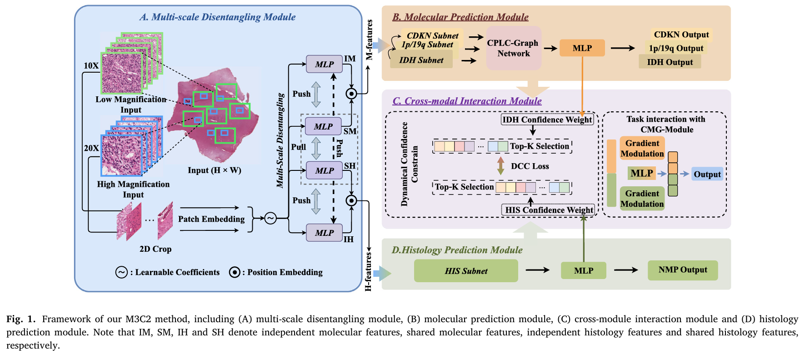

<h1 align='center' style="text-align:center; font-weight:bold; font-size:2.0em;letter-spacing:2.0px;">
                  M3C2

<h1 align='center' style="text-align:center; font-weight:bold; font-size:2.0em;letter-spacing:2.0px;">
              Joint Modelling Histology and Molecular Markers for Glioma Classification</h1>    
              
<p align='center' style="text-align:center;font-size:1.25em;">
    Xiaofei Wang<sup>a,1</sup>, 
    Hanyu Liu<sup>b,1</sup>, 
    Yupei Zhang<sup>a</sup>, 
    Boyang Zhao<sup>b</sup>, 
    Hao Duan<sup>c</sup>, 
    Wanming Hu<sup>d</sup>,
    Yonggao Mou<sup>c</sup>, 
    Stephen Price<sup>a</sup>, 
    Chao Li<sup>a,b,e,f</sup>&nbsp;<br/>
    <sup>a</sup> <strong>Department of Clinical Neurosciences, University of Cambridge, UK</strong><br/>
    <sup>b</sup> <strong>School of Science and Engineering, University of Dundee, UK</strong><br/>
    <sup>c</sup> <strong>Department of Neurosurgery, State Key Laboratory of Oncology in South China, Guangdong Provincial Clinical Research Center for Cancer, Sun Yat-sen
 University Cancer Center, China</strong><br/>
    <sup>d</sup> <strong>Department of Pathology, State Key Laboratory of Oncology in South China, Guangdong Provincial Clinical Research Center for Cancer, Sun Yat-sen University
 Cancer Center, China</strong><br/>
    <sup>e</sup> <strong>Department of Applied Mathematics and Theoretical Physics, University of Cambridge, UK</strong>
    <sup>f</sup> <strong>School of Medicine, University of Dundee, UK</strong>
</p>


<div align="center">
  <a href="https://www.sciencedirect.com/science/article/pii/S1361841525000532" target="_blank" rel="external nofollow noopener">
  </a>
</div>
</p>

## 📣 Latest Updates

- **[2025-03-25]** 📊 *M3C2 Code have been released!*
- **[2025-02-04]** 📝 *M3C2 paper preprint is now available on [Medical Image Analysis]([https://arxiv.org/abs/your-link](https://www.sciencedirect.com/science/article/pii/S1361841525000532)).*
- **[2024-12-04]** 🎉 *M3C2 has been accepted to Medical Image Analysis!*
- **[2024-08-02]** 📝 *M3C2 are now submitted to the Medical Image Analysis.*

## Key Takeaways

- **M3C2** presents a groundbreaking framework for cancer classification by integrating histology and molecular markers.  
  🧠 **Key Innovation**: The framework employs **multi-scale disentangling modules** to extract both **high-magnification cellular-level** and **low-magnification tissue-level** features, which are then used to predict histology and molecular markers simultaneously.

- The method introduces a **Co-occurrence Probability-based Label-Correlation Graph (CPLC-Graph)** to model the relationships between multiple molecular markers.  
  This enhancement leads to better classification accuracy by capturing **intrinsic marker co-occurrences** and their impact on cancer classification.

- **Cross-Modal Interaction** is key to the model’s success.  
  🔄 **Interaction Mechanism**: By using **dynamic confidence constraints** and a **cross-modal gradient modulation strategy**, M3C2 efficiently aligns the prediction tasks for histology and molecular markers, ensuring both tasks complement each other for more accurate results.

- **Validation Across Diverse Datasets**: M3C2 outperforms existing state-of-the-art methods in **glioma classification** and **molecular marker prediction**, showcasing its robustness in **internal** and **external validation datasets**.  
  📊 **Performance**: The method achieves significant improvements, with **accuracy** and **AUC scores** surpassing previous models by as much as **5.6%** in certain tasks.

- **Clinical Implications**: The ability to predict molecular markers directly from **whole-slide images (WSIs)**, combined with the model's capacity to understand the interactions between histology and molecular data, offers strong potential for **precision oncology**.  
  🏥 **Impact**: M3C2’s approach aligns with the latest **WHO glioma classification criteria**, making it a promising tool for clinical decision-making and personalized cancer treatment.




## About this code

he M3C2 codebase is written in Python and focuses on integrating histology features and molecular markers for cancer classification. It uses various deep learning techniques for analyzing whole-slide images (WSIs) and predicting cancer types, particularly gliomas. The core module structure is as follows:

```
M3C2-main/
├── CPTAC.xlsx                    # Dataset containing clinical and molecular data for cancer classification (CPTAC).
├── IvYGAP.xlsx                    # Dataset containing data for glioma diagnosis and treatment (IvYGAP).
├── TCGA.xlsx                      # Dataset from The Cancer Genome Atlas (TCGA) for glioma classification.
├── merge_who.xlsx                 # Merged dataset based on the latest WHO glioma classification.
├── README.md                      # Overview of the project, its purpose, and instructions for usage.
├── data_process.py                # Script to process and clean datasets for model training.
├── dataset.py                     # Defines the dataset structure and loading mechanism for WSIs.
├── dataset_mine.py                # Alternative dataset processing script with additional feature extraction.
├── feature_generation.py          # Generates features required for classification from raw data.
├── model.py                       # Defines the neural network architecture used for cancer classification.
├── net.py                         # Contains code for building the network layers of the model.
├── evaluation.py                  # Script to evaluate the model’s performance on various tasks.
├── post_processing.py             # Post-processing of model predictions such as filtering or formatting.
├── main.py                        # Main script for running the model with specified parameters.
├── main_noGrad_guide.py           # Variant of the main script with gradient updates disabled for specific tasks.
├── main_miccai.py                 # Main script variant used for experiments aligned with MICCAI conference.
├── main_noLCloss.py               # Variant without the label correlation loss for model training.
├── model_copy.py                  # Another copy of the model code, likely with experimental variations.
├── roc_plot.py                    # Script for plotting ROC curves to evaluate model performance.
├── test_forroc.py                 # Testing script specifically for evaluating model performance via ROC.
├── transform                      # Folder containing data transformation functions for WSIs.
│   ├── augmentations.py           # Defines data augmentation methods (e.g., rotation, zoom).
│   ├── normalize.py               # Script for normalizing the input data (WSIs).
├── utils.py                       # Contains helper functions used throughout the project.
├── utils_finetune.py              # Utility functions specifically for fine-tuning the model.
├── logs.py                        # Handles logging of training and testing results.
├── __pycache__                    # Folder containing Python bytecode files for faster execution.
```

## How to apply the work
### 1. Environment
- Python >= 3.7
- Pytorch >= 1.12 is recommended
- opencv-python
- sklearn
- matplotlib


### 2. Train
Use the below command to train the model on our database.
```
    python ./main.py 
```

### 3. Test
Use the below command to test the model on our database.
```
    python ./test_main.py
```

### 4. Datasets
```
https://www.kaggle.com/datasets/liuhanyu1007/m3c2-data
```

### 5. Model
```
https://www.kaggle.com/models/liuhanyu1007/m3c2_model
```

## Contact
- Hanyu Liu: 2485644@dundee.ac.uk
- Xiaofei Wang: xw405@cam.ac.uk

Please open an issue or submit a pull request for issues, or contributions.

## 💼 License

<a href="https://opensource.org/licenses/MIT" target="_blank" rel="noopener noreferrer">
  
</a>

## Citation

If you find our benchmark is helpful, please cite our paper:

```
@article{wang2025joint,
  title={Joint Modelling Histology and Molecular Markers for Cancer Classification},
  author={Wang, Xiaofei and Liu, Hanyu and Zhang, Yupei and Zhao, Boyang and Duan, Hao and Hu, Wanming and Mou, Yonggao and Price, Stephen and Li, Chao},
  journal={arXiv preprint arXiv:2502.07979},
  year={2025}
}
```
